# SpringCloud - Eureka

## Eureka 简介

Eureka 是 Netflix 在线影片公司开源的一个服务注册与发现组件。

### CAP 原则

CAP 原则又称CAP定理，指的是在一个分布式系统中，

一致性（Consistency）：集群中的机器数据一致

可用性（Availability）：当一个节点挂掉，整个集群可以继续对外提供服务

分区容错性（Partition tolerance）：由于机器网络或分区等原因会导致各个机器中的数据短暂不一致。

CAP原则指的是，这三个要素最多只能同时实现两点，不可能三者兼顾。

在分布式服务中，P（分区容错性）的特性必须要存在，即必须要保证容错性，所以就要在C/A中做取舍。

CP：数据是一致的，但是如果有节点挂掉，整个服务在几分钟的时间内是无法访问使用的。

AP：数据可能是不一致的。

> Spring Cloud Eureka 和 Zookeeper 的区别

ZK(Zookeeper)遵循 CP 原则

Eureka 注重 AP 高可用

C：数据一致性

Zk 注重数据的一致性

Eureka 不是很注重数据的一致性

A：服务的可用性

在 Zk 里边，如果主机挂了，整个 zk 集群整体不对外提供服务，需要选一个新的出来才能继续对外提供服务。

Eureka 注重服务的可用性，集群中只有一台或者，就能对外提供服务。

> 其他的注册中心

Consul

Nacos

### 搭建注册中心服务

创建一个 SpringBoot 项目，添加 eureka 依赖

```xml
<properties>
        <java.version>1.8</java.version>
        <spring-cloud.version>2021.0.3</spring-cloud.version>
    </properties>
    <dependencies>
        <dependency>
            <groupId>org.springframework.cloud</groupId>
            <artifactId>spring-cloud-starter-netflix-eureka-server</artifactId>
        </dependency>

        <dependency>
            <groupId>org.springframework.boot</groupId>
            <artifactId>spring-boot-starter-test</artifactId>
            <scope>test</scope>
        </dependency>
    </dependencies>
    <!-- 依赖管理 只是帮你去管理版本号以及子模块的依赖 -->
    <dependencyManagement>
        <dependencies>
            <dependency>
                <groupId>org.springframework.cloud</groupId>
                <artifactId>spring-cloud-dependencies</artifactId>
                <version>${spring-cloud.version}</version>
                <type>pom</type>
                <scope>import</scope>
            </dependency>
        </dependencies>
    </dependencyManagement>
```

修改配置

```yml
server:
  port: 8761 # eureka的默认端口
spring:
  application:
    name: eureka-server # 应用名称 一般就写服务名字 不要使用特殊字符
```

在 服务启动类上添加 @EnableEurekaServer 注解，启动服务。

浏览器访问：http://localhost:8761

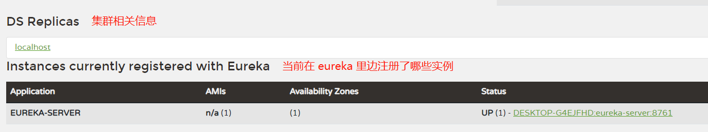

实例：真正的例子，具体的东西，再次指的是一个真实的服务

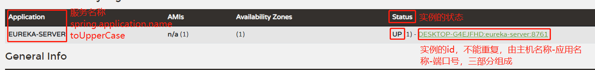

### 创建注册中心客户端

创建一个 SpringBoot 项目，添加 eureka-clent 依赖

```xml
 <dependencies>
        <dependency>
            <groupId>org.springframework.boot</groupId>
            <artifactId>spring-boot-starter-web</artifactId>
        </dependency>
        <dependency>
            <groupId>org.springframework.cloud</groupId>
            <artifactId>spring-cloud-starter-netflix-eureka-client</artifactId>
        </dependency>
    </dependencies>
    <dependencyManagement>
        <dependencies>
            <dependency>
                <groupId>org.springframework.cloud</groupId>
                <artifactId>spring-cloud-dependencies</artifactId>
                <version>${spring-cloud.version}</version>
                <type>pom</type>
                <scope>import</scope>
            </dependency>
        </dependencies>
    </dependencyManagement>
```

修改配置文件

```yml
server:
  port: 8080 # 客户端的端口

spring:
  application:
    name: eureka-client-a
# 注册的含义是什么？就是将自己的一些信息(ip port...)发送过去（发到哪里）
eureka:
  client:
    service-url: # 注册的地址
      defaultZone: http://localhost:8761/eureka
```

在服务启动类上添加 @EnableEurekaClient 注解

刷新注册中心页面，查看服务注册是否成功

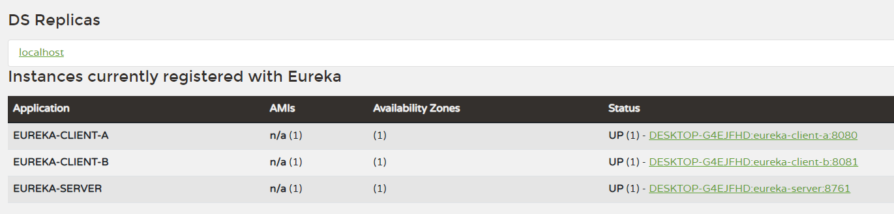

> 搭建一个客户端集群

搭建客户端集群时，只需要修改 port 端口号即可，其他任何配置不需要修改。

Idea启动集群的方式：

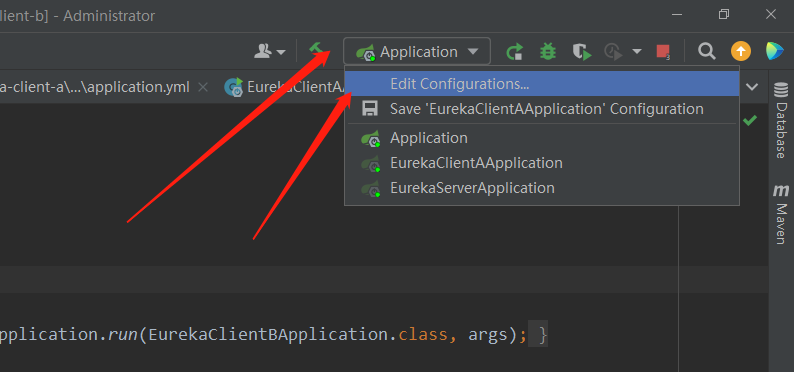

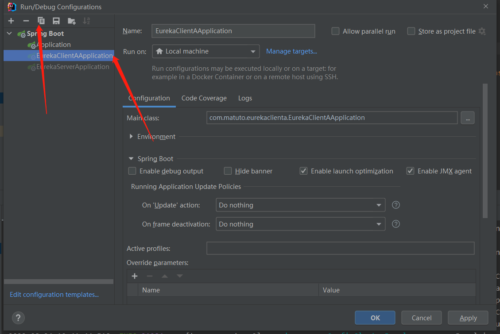

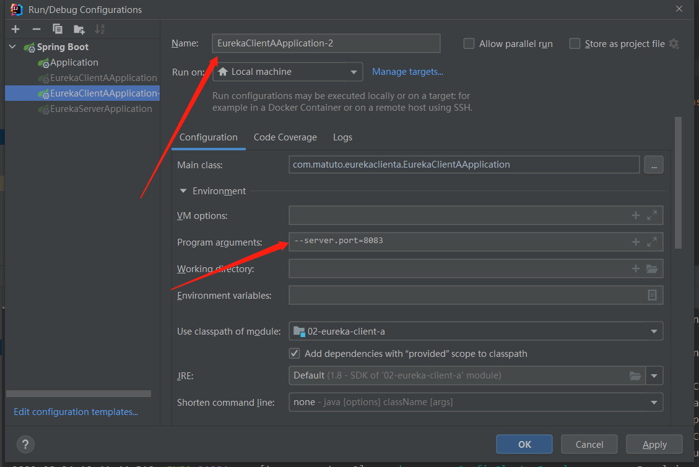

复制出一份配置，只需要在 jar 启动的时候，添加修改端口的命令即可。

启动服务后查看 eureka 注册中心

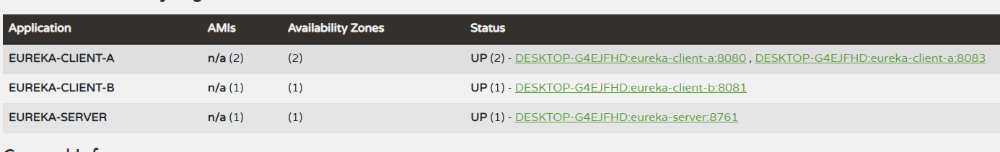

### eureka 配置详解

> 服务端相关配置

```yml
# eureka 的配置分为三类 server client 实例
eureka:
  server: # 服务的配置
    eviction-interval-timer-in-ms: 10000 # 服务端间隔多少毫秒做定期删除的操作
    renewal-percent-threshold: 0.85 # 续约百分比 一段时间内超过85%的应用没有和你续约，那么eureka会保护服务 不会剔除任何一个服务
  instance:  # 实例的配置
   instance-id: ${eureka.instance.hostname}:${spring.application.name}:${server.port}   # 实例Id - 主机名称:应用名称:端口号
   hostname: localhost  # 主机名称 或者服务器IP
   prefer-ip-address: true  # 以ip的形式显示具体的服务信息
   lease-renewal-interval-in-seconds: 5   # 服务实例的续约的时间间隔
```

> 客户端相关配置

```yml
eureka:
  client: #客户端的相关配置
    service-url: # 注册的地址
      defaultZone: http://localhost:8761/eureka
    register-with-eureka: true  # 可以不往eureka-server注册
    fetch-registry: true  #应用是否拉取服务列表到本地
    registry-fetch-interval-seconds: 10  # 为了缓解服务列表的脏读问题 时间越短脏读越少 性能消耗越大
  instance:
    hostname: localhost # 应用的主机名称 最好是写ip
    instance-id: ${eureka.instance.hostname}:${spring.application.name}:${server.port}
    prefer-ip-address: true # 显示ip
    lease-renewal-interval-in-seconds: 10 # 实例续约的时间
```

## 搭建注册中心集群

> 集群的方案

中心化集群

    主从模式集群，主节点挂掉后，只能读不能写

去中心化集群

    所有的节点，任意可写可读，挂掉任一节点后不影响整体功能。

去中心化集群没有主从的概念，eureka会将数据进行广播和扩散

### 集群搭建

创建三个 spring boot 项目，并添加好 eureka 服务的依赖

修改配置文件

```yml
# euraka-server-a
server:
  port: 8761 # eureka的默认端口
spring:
  application:
    name: eureka-server # 应用名称 一般就写服务名字 不要使用特殊字符
eureka:
  client:
    service-url: # 服务端不写注册地址 默认向自己注册
      defaultZone: http://localhost:8762/eureka,http://localhost:8763/eureka
  instance: # 实例的配置
    instance-id: ${eureka.instance.hostname}:${spring.application.name}:${server.port}   # 实例Id - 主机名称:应用名称:端口号
    hostname: localhost  # 主机名称 或者服务器IP
    prefer-ip-address: true  # 以ip的形式显示具体的服务信息
    lease-renewal-interval-in-seconds: 5   # 服务实例的续约的时间间隔

# eureka-server-b
server:
  port: 8762 # eureka的默认端口
spring:
  application:
    name: eureka-server # 应用名称 一般就写服务名字 不要使用特殊字符
eureka:
  client:
    service-url: # 服务端不写注册地址 默认向自己注册
      defaultZone: http://localhost:8761/eureka,http://localhost:8763/eureka
  instance: # 实例的配置
    instance-id: ${eureka.instance.hostname}:${spring.application.name}:${server.port}   # 实例Id - 主机名称:应用名称:端口号
    hostname: localhost  # 主机名称 或者服务器IP
    prefer-ip-address: true  # 以ip的形式显示具体的服务信息
    lease-renewal-interval-in-seconds: 5   # 服务实例的续约的时间间隔

# eureka-server-c
server:
  port: 8763 # eureka的默认端口
spring:
  application:
    name: eureka-server # 应用名称 一般就写服务名字 不要使用特殊字符
eureka:
  client:
    service-url: # 服务端不写注册地址 默认向自己注册
      defaultZone: http://localhost:8761/eureka,http://localhost:8762/eureka
  instance: # 实例的配置
    instance-id: ${eureka.instance.hostname}:${spring.application.name}:${server.port}   # 实例Id - 主机名称:应用名称:端口号
    hostname: localhost  # 主机名称 或者服务器IP
    prefer-ip-address: true  # 以ip的形式显示具体的服务信息
    lease-renewal-interval-in-seconds: 5   # 服务实例的续约的时间间隔
```

如上是三个 eureka 服务的相关配置，这里三个配置不一样的地方就是端口及注册地址。

**eureka 服务如果不写注册地址，默认是向自己注册，这里我们要做集群就要显式向另外的 eureka 服务注册**

eureka源码：

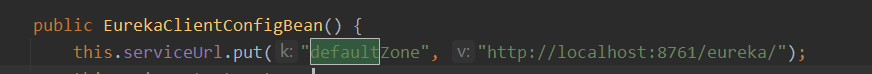

访问三个 eureka 服务

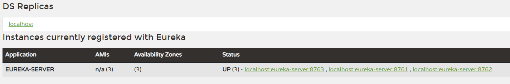

但是现在有一个问题，我们这么做只是在一台机器上启动了三个 eureka 的服务，并不能组成集群，这里我们修改 hosts 文件来进行模拟。

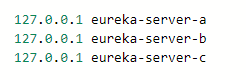

修改完 hosts 文件后，将配置文件中的信息同样进行修改。

```yml
 # eureka-server-a
 defaultZone: http://eureka-server-b:8762/eureka,http://eureka-server-c:8763/eureka
 hostname: eureka-server-a

 # eureka-server-b
 defaultZone: http://eureka-server-a:8761/eureka,http://eureka-server-c:8763/eureka
 hostname: eureka-server-b

 # eureka-server-c
 defaultZone: http://eureka-server-a:8761/eureka,http://eureka-server-b:8762/eureka
 hostname: eureka-server-c
```

重启服务后，查看 eureka 页面

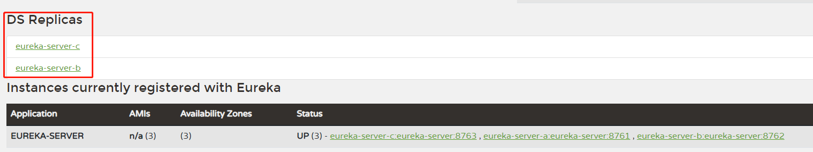

显示出了集群信息。

### 客户端注册到服务集群

客户端往任一 eureka 服务节点中进行注册，都会同步到其他节点。

```yml
# eureka-client-a
defaultZone: http://localhost:8761/eureka
```

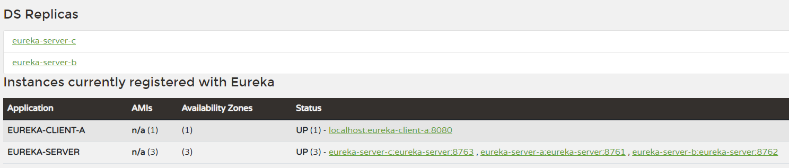

但是这种方式，服务端工程复杂，客户端也只向一台服务端进行了注册，所以我们进行一些优化。

服务端配置文件修改：

```yml
# 优化方案
server:
  port: 8761 # eureka的默认端口
spring:
  application:
    name: eureka-server # 应用名称 一般就写服务名字 不要使用特殊字符
eureka:
  client:
    service-url: # 服务端不写注册地址 默认向自己注册
      defaultZone: http://eureka-server-a:8761/eureka,http://eureka-server-b:8762/eureka,http://eureka-server-c:8763/eureka
  instance: # 实例的配置
    instance-id: {spring.application.name}:${server.port}   # 实例Id - 主机名称:应用名称:端口号
#    hostname: eureka-server-a  # 主机名称 或者服务器IP
    prefer-ip-address: true  # 以ip的形式显示具体的服务信息
    lease-renewal-interval-in-seconds: 5   # 服务实例的续约的时间间隔
```

这样我们就不用多个工程了，只需要一个项目在启动时添加上不同的端口就可以了

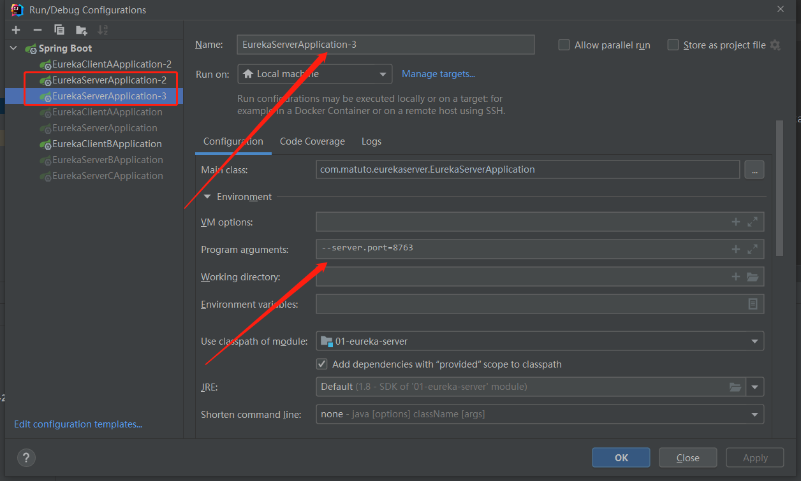

启动后访问

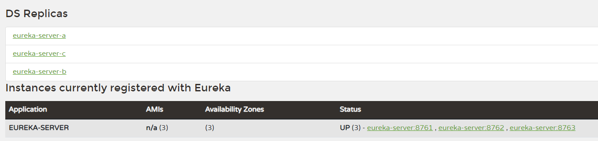

服务跟集群信息都正常

同样修改客户端，让其向三个服务端同时进行注册

```yml
# eureka-client-a
defaultZone: http://eureka-server-a:8761/eureka,http://eureka-server-b:8762/eureka,http://eureka-server-c:8763/eureka
```

启动后刷新 eureka 服务页面

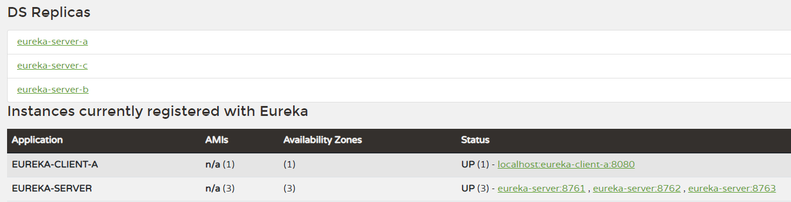

客户端在三个服务端上都正常展示。

## 集群的深入理解

> 主从模式主机该怎么选择

在 redis 的哨兵模式中，如果 a 是主节点，那么当 a 节点挂掉后，哨兵是怎么决定在 b/c 两台机器中，选择哪一台成为主节点的呢？

**分布式数据一致性协议 Paxos raft**

Zookeeper 使用的是 Paxos 协议

eureka 没有分布式数据一致性的机制 节点都是相同的

Nacos 使用的是 raft 协议

在有主从模式的集群中 一般都要遵循这样的协议 才能稳定对外提供服务

在 Raft 协议中，有两个控制选举的超时设置

超时选举：

    选举超时随机在 150 毫秒到 300 毫秒之间，选举超时后，先超时的从节点成为被选举状态（即投了自己一票），这时会向其他从节点发送请求，如果接受请求的节点在这个时候还没有进行投票，那么他会投票给被选举状态的从节点，一旦被选举状态的节点获得了多数票，那么他就成为主节点，这时会向集群中的其他从节点发送心跳包（以心跳超时指定的间隔发送），确保集群状态的正常，当主节点挂掉（接收不到心跳包时），又会进行同样的选举操作，即所有的从节点进入选举超时。

分裂投票：

    如果有四个节点，两个节点同时选举超时，同时向其他子节点发送消息，这时进入被选举状态的两个节点都可以获得三票，这时所有节点将又会进入选举超时状态，等待新的选举并重试。

> 主从模式数据是怎么同步的

主节点要做出操作时，先通知所有从节点，当集群中的大部分节点都做出响应时，操作成功。 -- 多数派

在主节点向从节点同步数据时，是有两步的，主节点会先通知从节点要进行数据同步，接收到从节点响应后，会进行数据的同步，是两步操作。

当主节点收到一条命令，int i = 5, 这是主节点并不会立即执行这个命令，而是会放到日志中存储，他会将消息（int i = 5）通知给集群中的所有子节点，当主节点收到所有子节点的回复时，才会执行 int i = 5 这条命令，这节点执行完毕后，会通知所有子节点，你们可以执行 int i = 5 这条命令了，主节点会收到子节点的回复。这时集群就系统状态达成共识。 

 **分布式共识协议**

## Eureka 概念的理解

> 服务的注册

当项目启动时（eureka 的客户端），就会向 eureka - server 发送自己的**元数据**（原始数据）（运行的IP，端口 port，健康状态等），eureka - server 会在自己内部保留这些元数据（内存中）（一个服务列表）。

> 服务的续约

项目启动成功了，除了向 eureka - server 注册自己成功，还会定时的向 eureka - server 汇报自己，心跳，表示服务状态正常，

> 服务的下线（主动下线）

当项目关闭时，会给 eureka - server 报告，说明自己要销毁了

> 服务的剔除（被动下线，主动剔除）

当项目超过了指定时间没有向 eureka - server 汇报自己，那么 eureka - server 就会认为此节点死掉了，就会把它剔除掉，也不会放流量和请求到此节点了。

## Eureka 源码分析

### Eureka 运作原理的特点

Eureka - server  对外提供的是 restful 风格的服务

http 服务 + 特定的请求方式 + 特定的 url 地址

> 服务注册源码分析

**重要的类**

DiscoveryClient 里面的 register() 方法完后注册的总体构造

AbstractJerseyEurekaHttpClient 里面的 register() 方法具体发送注册请求（post）

InstanceRegistry 里面的 register() 方法接受客户收的注册请求

PeerAwareInstanceRegistryImpl 里面调用父类的 register() 方法实现注册

AbstractInstanceRegistry 里面的 register() 方法完成具体的注册保留数据到 map 集合

**保存服务实例数据的集合**

第一个 key 是应用名称（toUpperCase）spring.application.name

value 中的 key 是应用的实例 id eureka.instance.instance-id

value 中的 value 是具体的服务节点信息

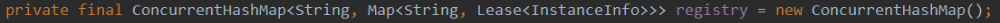

> 服务续约源码

客户端发送 put 请求

服务续约就是修改时间

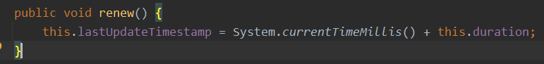

> 服务下线

客户端发送 delete 请求，服务端将实例从服务列表中移除

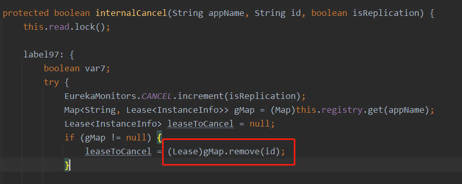

> 剔除服务

判断服务是否超时，超时后调用服务下线方法，进行剔除

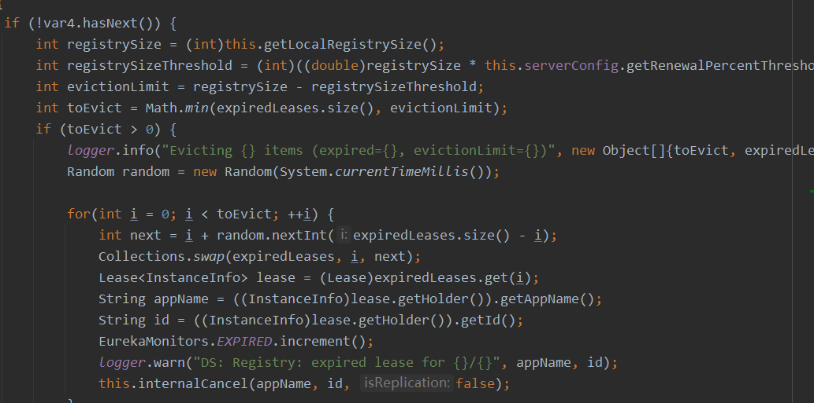

### 服务发现

```java
@RestController
public class DiscoveryController {

    @Autowired
    private DiscoveryClient discoveryClient;
    /**
     * 通过应用名称 找到服务的ip和端口
     * @param serviceName
     * @return
     */
    @GetMapping("/test")
    public String doDiscovery(String serviceName) {

        // 这就是服务发现 通过服务的应用名 找到服务的具体信息
        List<ServiceInstance> instances = discoveryClient.getInstances(serviceName);
        instances.forEach(System.out::println);
        ServiceInstance serviceInstance = instances.get(0);
        String host = serviceInstance.getHost();
        int port = serviceInstance.getPort();
        System.out.println(host +":" + port);
        return instances.get(0).toString();
    }
}
```
