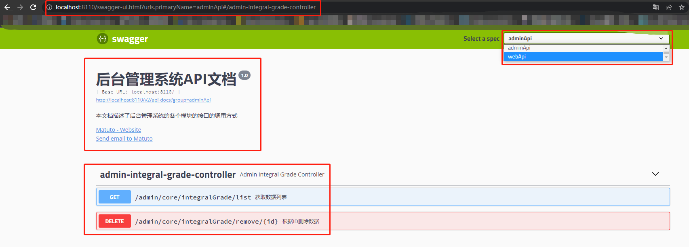

# Swagger2 在项目中的使用

### 什么是Swagger2

**Swagger2**是一个规范和完整的框架，用于**生成、描述、调用和可视化RESTful 风格的Web 服务**

它可以动态生成 API 接口文档，减低沟通成本，提高工作效率。

### 引入依赖

```xml
 <!--swagger-->
<dependency>
    <groupId>io.springfox</groupId>
    <artifactId>springfox-swagger2</artifactId>
    <version>2.9.2</version>
</dependency>
<!--swagger ui-->
<dependency>
    <groupId>io.springfox</groupId>
    <artifactId>springfox-swagger-ui</artifactId>
    <version>1.9.6</version>
</dependency>
```

### 配置类

```java
/**
 * @ClassName Swagger2Config
 * @Author Majz
 * @date 2022/5/23 9:30
 * @Version 1.0
 */
@Configuration
@EnableSwagger2
public class Swagger2Config {

    @Bean
    public Docket apiAdminConfig() {
        return new Docket(DocumentationType.SWAGGER_2)
                .groupName("adminApi")
                .apiInfo(adminApiInfo())
                .select()
                .paths(Predicates.and(PathSelectors.regex("/admin/.*")))
                .build();
    }

    private ApiInfo adminApiInfo() {
       return new ApiInfoBuilder().title("后台管理系统API文档")
                .description("本文档描述了后台管理系统的各个模块的接口的调用方式")
                .version("1.0")
                .contact(new Contact("Matuto","https://www.majingzhen.com","matuto@tom.com"))
                .build();
    }

    @Bean
    public Docket apiWebConfig() {
        return new Docket(DocumentationType.SWAGGER_2)
                .groupName("webApi")
                .apiInfo(webApiInfo())
                .select()
                .paths(Predicates.and(PathSelectors.regex("/api/.*")))
                .build();
    }

    private ApiInfo webApiInfo() {
        return new ApiInfoBuilder().title("网站API文档")
                .description("本文档描述了网站的各个模块的接口的调用方式")
                .version("1.0")
                .contact(new Contact("Matuto","https://www.majingzhen.com","matuto@tom.com"))
                .build();
    }
}
```

### Controller 代码

```java
@CrossOrigin
@RestController
@RequestMapping("/admin/core/integralGrade")
@Api(value = "积分等级管理")
public class AdminIntegralGradeController {

    @Resource
    private IntegralGradeService integralGradeService;

    @ApiOperation(value = "获取数据列表", notes = "非分页列表")
    @GetMapping("/list")
    public List<IntegralGrade> listAll() {
        return integralGradeService.list();
    }

    @ApiOperation(value = "根据ID删除数据", notes = "逻辑删除")
    @DeleteMapping("/remove/{id}")
    public boolean removeBeId(@PathVariable("id") Long id) {
        return integralGradeService.removeById(id);
    }
}
```

### 效果展示



### 常用注解

- @Api：对请求类的说明，描述Controller的作用
- @ApiOperation：方法的说明，用在接口上
- @ApiParam：单个参数描述
- @ApiModel：用在 JavaBean 上，描述整个 JavaBean 作用
- @ApiModelProperty：用在 JavaBean 的属性上，描述对象的字段
- @ApiImplicitParam：方法参数的说明(一个)
- @ApiImplicitParams：方法参数的说明(多个)
