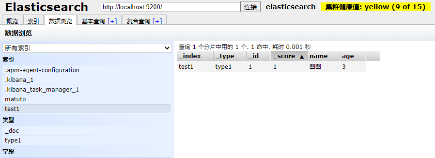
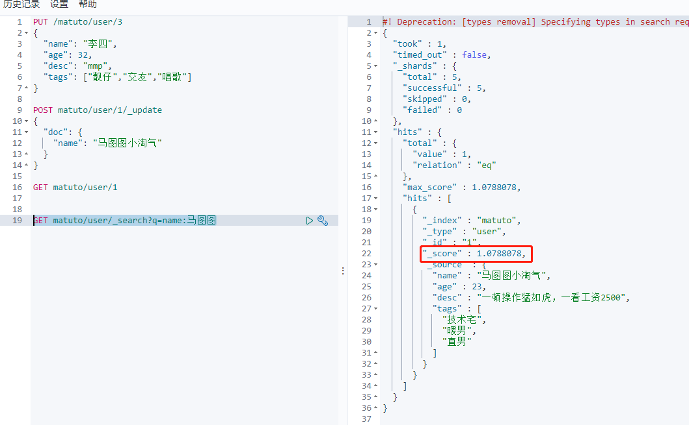

# ElasticSearch - 02 简单使用

笔记源自观看狂神说 ES 课程：https://www.bilibili.com/video/BV17a4y1x7zq?p=8&spm_id_from=pageDriver

## IK 分词器

分词：即把一段中文或者别的划分成一个个的关键字，我们在搜索时会把自己的信息进行分词，会把数据库中或者索引库中的数据进行分词，然后进行一个匹配操作，默认的中文分词是将每个字都看成一个词，比如“我爱狂神” 会被分为“我”，“爱”，“狂”，“神”，这显然是不符合要求的，所以我们需要安装中文分词器 ik 来解决这个问题。

如果使用中文，建议使用 ik 分词器。

IK 提供了两个分词算法：ik_smart 和 ik_max_word，其中 ik_smart 为最少切分，ik_max_word 为最细粒度划分。

> 安装

1、下载地址：https://github.com/medcl/elasticsearch-analysis-ik

2、将下载下来的文件解压到 elasticsearch-7.6.1\plugins\ik 文件夹中，ik 文件夹需要自己新建。


3、重启ElasticSearch

4、可以使用 elasticsearch-plugin list 命令查看 插件


> 使用Kibana测试

其中 ik_smart 为最少切分，不会出现重复词。


ik_max_word 为最细粒度划分，会拆分成所有他所理解的词，会重复。


这里的所有词语的拆分都是由 ik 分词器的字典来控制的，如果我们想将自己的词语(图图)被当作一个整体，那么就需要将词语加入到字典中。

> ik 分词器增加自己的配置

配置文件在 ik 目录下 config/IKAnalyzer.cfg.xml


在配置文件中配置自己的字典数据。

重启 es 后，再次尝试。


工作中，我们需要自己配置分词就在自定义的dic文件中进行配置即可！

## Rest 风格

一种软件架构风格，而不是标准，只是提供了一组设计原则和约束条件。它主要用于客户端和服务器交互类的软件。基于这个风格设计的软件可以更简洁，更有层次，更易于实现缓存等机制。

基本Rest命令说明：

| method | url地址                                 | 描述           |
| ------ | ------------------------------------- | ------------ |
| PUT    | localhost:9200/索引名称/类型名称/文档id         | 创建文档（指定文档id） |
| POST   | localhost:9200/索引名称/类型名称              | 创建文档（随机文档id） |
| POST   | localhost:9200/索引名称/类型名称/文档id/_update | 修改文档         |
| DELETE | localhost:9200/索引名称/类型名称/文档id         | 删除文档         |
| GET    | localhost:9200/索引名称/类型名称/文档id         | 查询文档通过文档id   |
| POST   | localhost:9200/索引名称/类型名称/_search      | 查询所有数据       |

## 关于索引的基本操作

> 创建一个索引

```
PUT /索引名/~类型名~/文档id
{请求体}
```


新建了索引，数据也添加成功。



> es 的数据类型

- 字符串类型
  
  text,keyword

- 数值类型
  
  long,integer,short,byte,double,float,half float,scaled float

- 日期类型
  
  date

- 布尔值类型
  
  boolean

- 二进制类型
  
  binary

- 等等......

> 创建规则


> 通过 GET 请求获取具体的信息


> 默认类型


如果自己的文档字段没有指定，那么 es 就会给我们默认配置字段类型！

扩展：通过 get _cat 命令，可以获得 es 当前的很多信息，es-head 就是一个可视化的工具集

> 修改 提交还是使用 PUT 即可，然后覆盖！


覆盖修改，修改完成后 _version 会增加，result 会改变为 updated，这种方法的弊端在于，如果修改时少填了字段，那么这个字段就会删掉。

使用 POST 方式进行修改


> 删除索引


通过 DELETE 命令实现删除，根据你的请求来判断是删除索引还是删除文档记录。

## 关于文档的基本操作

### 基本操作

1、添加数据

```
PUT /matuto/user/1
{
  "name": "马图图",
  "age": 23,
  "desc": "一顿操作猛如虎，一看工资2500",
  "tags": ["技术宅","暖男","直男"]
}
```

2、查询数据

```
GET matuto/user/1
```

3、更新数据 建议使用POST /_update，PUT 不太好用，比较麻烦

```
POST matuto/user/1/_update
{
  "doc": {
    "name": "马图图小淘气"
  }
}
```

4、搜索

```
GET matuto/user/_search?q=name:马图图 _search 后跟搜索条件
```



搜索结果中，_score 字段代表搜索的匹配度，如果查询结果包含多条结果，匹配度越高，分数越高。

### 复杂操作搜索

> 基本匹配搜索

```
GET matuto/user/_search
{
  "query": {
    "match": {
      "name": "图图"
    }
  }
}
```


hit 中包含的信息有：最大匹配度、索引和文档的信息、查询的结果总数、查询出来的具体的文档

> _source: 结果过滤

```json
GET matuto/user/_search
{
  "query": {
    "match": {
      "name": "马图图"
    }
  },
  "_source": ["name", "desc"]
}
```

> sout: 排序 

```json
GET matuto/user/_search
{
  "query": {
    "match": {
      "name": "马图图"
    }
  },
  "sort": [
    {
      "age": {
        "order": "desc"
      }
    }
  ]
}
```

> 分页查询 from - size

```json
GET matuto/user/_search
{
  "query": {
    "match": {
      "name": "马图图"
    }
  },
  "from": 0, --- 从提几条开始
  "size": 1  --- 取多少条数据
}
```

数据下标从 0 开始。

> 布尔值查询 - 多条件精确查询 -  - should - must_not

must(and) = where name='马图图' and age = 23

```json
GET matuto/user/_search
{
  "query": {
    "bool": {
      "must": [
        {
          "match": {
            "name": "马图图"
          }
        },
        {
          "match": {
            "age": 23
          }
        }
      ]
    }
  }
}
```

should(or) = where name='马图图' or age = 23

```json
GET matuto/user/_search
{
  "query": {
    "bool": {
      "should": [
        {
          "match": {
            "name": "马图图"
          }
        },
        {
          "match": {
            "age": 23
          }
        }
      ]
    }
  }
}
```

must_not(not) = where age != 23

```json
GET matuto/user/_search
{
  "query": {
    "bool": {
      "must_not": [
        {
          "match": {
            "age": 23
          }
        }
      ]
    }
  }
}
```

> 过滤器 filter

range 范围， gt：大于，lt：小于

```json
GET matuto/user/_search
{
  "query": {
    "bool": {
      "must": [
        {
          "match": {
            "name": "马图图"
          }
        }
      ],
      "filter": {
        "range": {
          "age": {
            "gte": 2,
            "lte": 20
          }
        }
      }
    }
  }
}
```

> 多条件匹配查询

```json
GET matuto/user/_search
{
  "query": {
    "match": {
      "tags": "男 技术" --- 多条件用 空格 隔开
    }
  }
}
```

匹配的条件越多，匹配度(权重)越高。

> 精确查询

term 查询是直接通过倒排索引指定的词条进程精确查找的。

**关于分词：**

- term：直接精确查询
- match：会使用分词器解析（先分析文档，然后再通过分析的文档进行查询）

**text 与 keyword 类型对比**


keyword 是不会被分词器解析的，text 会。

**多条件精确查询**

```json
GET testdb/_search
{
  "query": {
    "bool": {
      "should": [
        {
          "term": {
            "t1": "22"
          }
        },
        {
          "term": {
            "t1": "33"
          }
        }
      ]
    }
  }
}
```

> 高亮查询 - highlight

```json
GET matuto/user/_search
{
  "query": {
    "match": {
      "name": "图图"
    }
  },
  "highlight": {
    "fields": {
      "name": {}
    }
  }
}
```


搜索结果高亮，匹配到的关键词默认使用 em 标签包裹。

**自定义标签**

```json
GET matuto/user/_search
{
  "query": {
    "match": {
      "name": "图图"
    }
  },
  "highlight": {
    "pre_tags": "<p class='key' style='color:red'>", 
    "post_tags": "</p>", 
    "fields": {
      "name": {}
    }
  }
}
```


