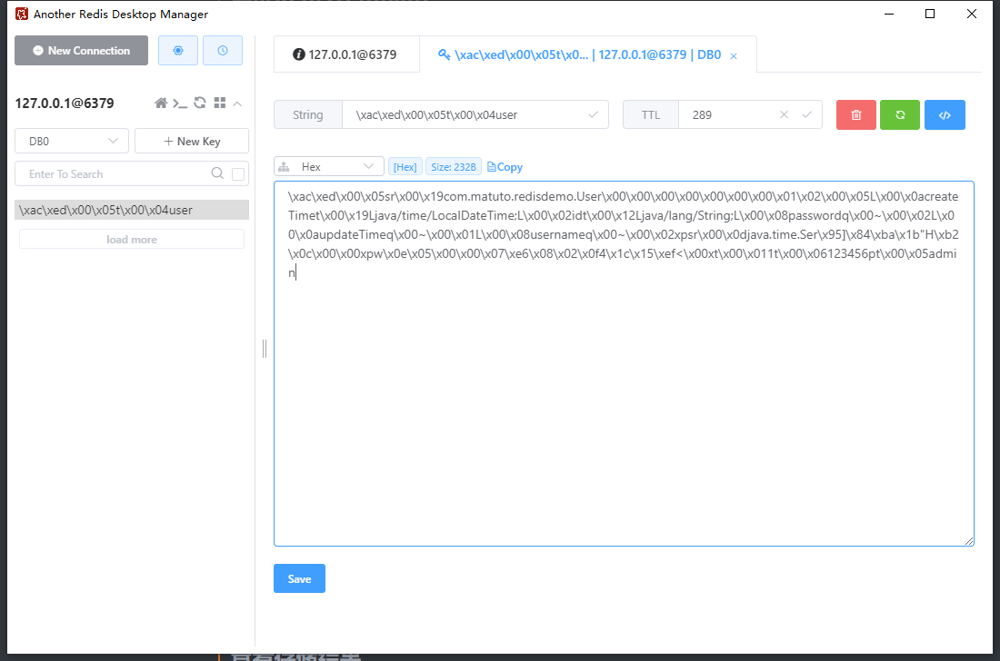
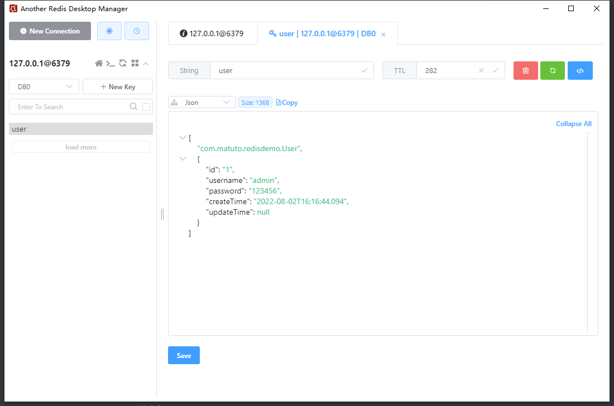

# SpringBoot整合Redis

这里我们直接在已有的SpringBoot项目中加入Redis

在Spring Boot项目中，默认集成Spring Data Redis，Spring Data Redis针对Redis提供了非常方便的操作模版RedisTemplate，并且可以进行连接池自动管理。

> ## 引入Redis

```xml
<!-- spring boot redis缓存引入 -->
<dependency>
    <groupId>org.springframework.boot</groupId>
    <artifactId>spring-boot-starter-data-redis</artifactId>
</dependency>
<!-- 缓存连接池-->
<dependency>
    <groupId>org.apache.commons</groupId>
    <artifactId>commons-pool2</artifactId>
</dependency>

<!-- redis 存储 json序列化 -->
<dependency>
    <groupId>com.fasterxml.jackson.core</groupId>
    <artifactId>jackson-databind</artifactId>
</dependency>
<dependency>
    <groupId>com.fasterxml.jackson.datatype</groupId>
    <artifactId>jackson-datatype-jsr310</artifactId>
</dependency>
```

> ## 测试RedisTemplate

```java
@Data
public class User implements Serializable {
    private static final long serialVersionUID = 1L;
    private String id;
    private String username;
    private String password;
    private LocalDateTime createTime;
    private LocalDateTime updateTime;
}
```

```java
@SpringBootTest
@RunWith(SpringRunner.class)
class RedisDemoApplicationTests {
    @Resource
    private RedisTemplate redisTemplate;
    @Test
    public void saveDict(){
        User user = new User();
        user.setId("1");
        user.setUsername("admin");
        user.setPassword("123456");
        user.setCreateTime(LocalDateTime.now());
        //向数据库中存储string类型的键值对, 过期时间5分钟
        redisTemplate.opsForValue().set("user", user, 5, TimeUnit.MINUTES);
    }
}
```

> ## 查看存储结果



发现RedisTemplate默认使用了JDK的序列化方式存储了key和value

> ## Redis 配置

添加RedisConfig，我们可以在这个配置文件中配置Redis序列化方案

```java
@Configuration
public class RedisConfig {


    @Bean
    public RedisTemplate<String, Object> redisTemplate(LettuceConnectionFactory redisConnectionFactory) {

        RedisTemplate<String, Object> redisTemplate = new RedisTemplate<>();
        redisTemplate.setConnectionFactory(redisConnectionFactory);

        //首先解决key的序列化方式
        StringRedisSerializer stringRedisSerializer = new StringRedisSerializer();
        redisTemplate.setKeySerializer(stringRedisSerializer);

        //解决value的序列化方式
        Jackson2JsonRedisSerializer<Object> jackson2JsonRedisSerializer = new Jackson2JsonRedisSerializer<>(Object.class);

        //序列化时将类的数据类型存入json，以便反序列化的时候转换成正确的类型
        ObjectMapper objectMapper = new ObjectMapper();
        //objectMapper.enableDefaultTyping(ObjectMapper.DefaultTyping.NON_FINAL);
        objectMapper.activateDefaultTyping(LaissezFaireSubTypeValidator.instance, ObjectMapper.DefaultTyping.NON_FINAL);

        // 解决jackson2无法反序列化LocalDateTime的问题
        objectMapper.disable(SerializationFeature.WRITE_DATES_AS_TIMESTAMPS);
        objectMapper.registerModule(new JavaTimeModule());

        jackson2JsonRedisSerializer.setObjectMapper(objectMapper);


        redisTemplate.setValueSerializer(jackson2JsonRedisSerializer);
        return redisTemplate;
    }
}
```

再次测试



key使用了字符串存储，value使用了json存储

> ## 取值测试

```java
@Test
public void getUser(){
    User user = (User)redisTemplate.opsForValue().get("user");
    System.out.println(user);
}
```
