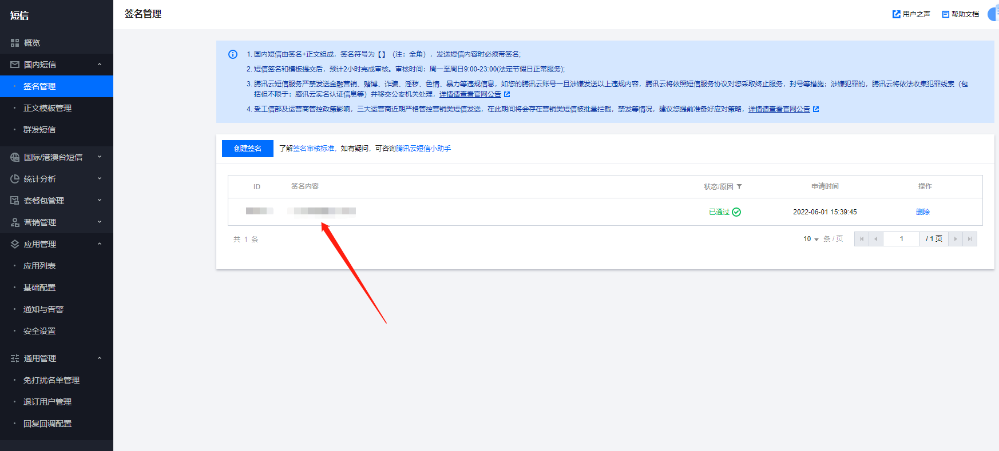
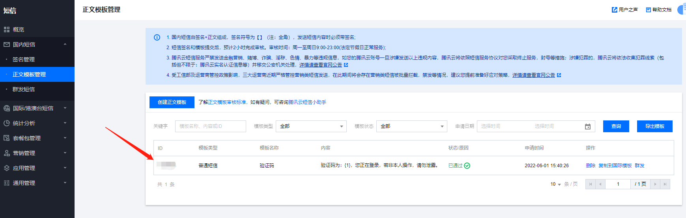
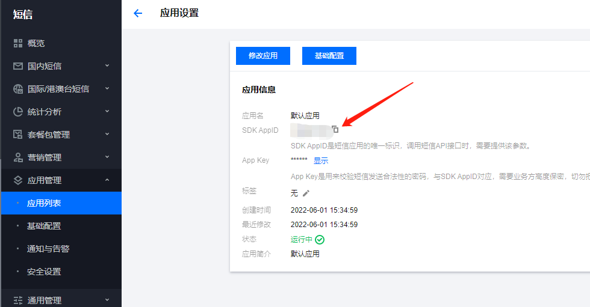

# SpringBoot 项目整合腾讯云短信业务

> 前置准备

注册腾讯云账号，申请开通短信业务， 创建短信签名及短信模板，审核通过后就能使用了，会赠送100条短信，测试够用了。

> 引入依赖

这里只展示了具体短信依赖，其他依赖自己按需引用

```xml
<!--lombok用来简化实体类：需要安装lombok插件-->
        <dependency>
            <groupId>com.tencentcloudapi</groupId>
            <artifactId>tencentcloud-sdk-java</artifactId>
            <!-- go to https://search.maven.org/search?q=tencentcloud-sdk-java and get the latest version. -->
            <!-- 请到https://search.maven.org/search?q=tencentcloud-sdk-java查询所有版本，最新版本如下 -->
            <version>3.1.524</version>
        </dependency>
```

> 配置

```yml
#腾讯云短信
tencent:
  sms:
    region-id: ap-nanjing                             # 地域参数
    sdk-app-id: xxxxxxxxxx                            # 短信 SdkAppId
    template-id: xxxxxxx                              # 模板 ID
    sign-name: '短信签名'                             # 短信签名内容
    secret-id: xxxxxxxxxxxxxxxx                       # API密钥 SecretId
    secret-key: xxxxxxxxxxxxxxxx                      # API密钥 SecretKey
```







SecretId、SecretKey 查询: https://console.cloud.tencent.com/cam/capi

> 创建配置类

```java
@Component
@Getter
@Setter
@ConfigurationProperties(prefix = "tencent.sms")
public class SmsProperties implements InitializingBean {

    private String regionId;
    private String sdkAppId;
    private String templateId;
    private String signName;
    private String secretId;
    private String secretKey;

    public static String REGION_ID;
    public static String SDK_APP_ID;
    public static String TEMPLATE_ID;
    public static String SIGN_NAME;
    public static String SECRET_ID;
    public static String SECRET_KEY;

    //当私有成员被赋值后，此方法自动被调用，从而初始化常量
    @Override
    public void afterPropertiesSet() throws Exception {
        REGION_ID = regionId;
        SDK_APP_ID = sdkAppId;
        TEMPLATE_ID = templateId;
        SIGN_NAME = signName;
        SECRET_ID = secretId;
        SECRET_KEY = secretKey;
    }
}
```

> 创建短信发送服务类

```java
@Service
@Slf4j
public class SmsServer {
    public void send(String mobile, String templateCode, Map<String, Object> param) {
        try {
            /* 必要步骤：
             * 实例化一个认证对象，入参需要传入腾讯云账户密钥对secretId，secretKey。
             * 这里采用的是从环境变量读取的方式，需要在环境变量中先设置这两个值。
             * 你也可以直接在代码中写死密钥对，但是小心不要将代码复制、上传或者分享给他人，
             * 以免泄露密钥对危及你的财产安全。
             * SecretId、SecretKey 查询: https://console.cloud.tencent.com/cam/capi */
            Credential cred = new Credential(SmsProperties.SECRET_ID, SmsProperties.SECRET_KEY);
            // 实例化一个http选项，可选，没有特殊需求可以跳过
            HttpProfile httpProfile = new HttpProfile();
            // 设置代理（无需要直接忽略）
            // httpProfile.setProxyHost("真实代理ip");
            // httpProfile.setProxyPort(真实代理端口);
            /* SDK默认使用POST方法。
             * 如果你一定要使用GET方法，可以在这里设置。GET方法无法处理一些较大的请求 */
            httpProfile.setReqMethod("POST");
            /* SDK有默认的超时时间，非必要请不要进行调整
             * 如有需要请在代码中查阅以获取最新的默认值 */
            httpProfile.setConnTimeout(60);
            /* 指定接入地域域名，默认就近地域接入域名为 sms.tencentcloudapi.com ，也支持指定地域域名访问，例如广州地域的域名为 sms.ap-guangzhou.tencentcloudapi.com */
            httpProfile.setEndpoint("sms.tencentcloudapi.com");
            /* 非必要步骤:
             * 实例化一个客户端配置对象，可以指定超时时间等配置 */
            ClientProfile clientProfile = new ClientProfile();
            /* SDK默认用TC3-HMAC-SHA256进行签名
             * 非必要请不要修改这个字段 */
            clientProfile.setSignMethod("HmacSHA256");
            clientProfile.setHttpProfile(httpProfile);
            /* 实例化要请求产品(以sms为例)的client对象
             * 第二个参数是地域信息，可以直接填写字符串ap-guangzhou，支持的地域列表参考 https://cloud.tencent.com/document/api/382/52071#.E5.9C.B0.E5.9F.9F.E5.88.97.E8.A1.A8 */
            SmsClient client = new SmsClient(cred, SmsProperties.REGION_ID,clientProfile);
            /* 实例化一个请求对象，根据调用的接口和实际情况，可以进一步设置请求参数
             * 你可以直接查询SDK源码确定接口有哪些属性可以设置
             * 属性可能是基本类型，也可能引用了另一个数据结构
             * 推荐使用IDE进行开发，可以方便的跳转查阅各个接口和数据结构的文档说明 */
            SendSmsRequest req = new SendSmsRequest();
            /* 填充请求参数,这里request对象的成员变量即对应接口的入参
             * 你可以通过官网接口文档或跳转到request对象的定义处查看请求参数的定义
             * 基本类型的设置:
             * 帮助链接：
             * 短信控制台: https://console.cloud.tencent.com/smsv2
             * 腾讯云短信小助手: https://cloud.tencent.com/document/product/382/3773#.E6.8A.80.E6.9C.AF.E4.BA.A4.E6.B5.81 */
            /* 短信应用ID: 短信SdkAppId在 [短信控制台] 添加应用后生成的实际SdkAppId，示例如1400006666 */
            // 应用 ID 可前往 [短信控制台](https://console.cloud.tencent.com/smsv2/app-manage) 查看
            req.setSmsSdkAppId(SmsProperties.SDK_APP_ID);
            /* 短信签名内容: 使用 UTF-8 编码，必须填写已审核通过的签名 */
            // 签名信息可前往 [国内短信](https://console.cloud.tencent.com/smsv2/csms-sign) 或 [国际/港澳台短信](https://console.cloud.tencent.com/smsv2/isms-sign) 的签名管理查看
            req.setSignName(SmsProperties.SIGN_NAME);
            /* 模板 ID: 必须填写已审核通过的模板 ID */
            // 模板 ID 可前往 [国内短信](https://console.cloud.tencent.com/smsv2/csms-template) 或 [国际/港澳台短信](https://console.cloud.tencent.com/smsv2/isms-template) 的正文模板管理查看
            req.setTemplateId(SmsProperties.TEMPLATE_ID);
            /* 模板参数: 模板参数的个数需要与 TemplateId 对应模板的变量个数保持一致，若无模板参数，则设置为空 */
            if (!param.containsKey("code")) {
                log.error("SendMessage is Error, code is null!");
                throw new RuntimeException("验证码不能为空");
            }
            String[] templateParamSet = {param.get("code").toString()};
            req.setTemplateParamSet(templateParamSet);
            /* 下发手机号码，采用 E.164 标准，+[国家或地区码][手机号]
             * 示例如：+8613711112222， 其中前面有一个+号 ，86为国家码，13711112222为手机号，最多不要超过200个手机号 */
            String[] phoneNumberSet = {mobile};
            req.setPhoneNumberSet(phoneNumberSet);
            log.info(SendSmsResponse.toJsonString(req));
            /* 通过 client 对象调用 SendSms 方法发起请求。注意请求方法名与请求对象是对应的
             * 返回的 res 是一个 SendSmsResponse 类的实例，与请求对象对应 */
            SendSmsResponse res = client.SendSms(req);
            // 输出json格式的字符串回包
            System.out.println(SendSmsResponse.toJsonString(res));
            log.info(SendSmsResponse.toJsonString(res));
            // 也可以取出单个值，你可以通过官网接口文档或跳转到response对象的定义处查看返回字段的定义
            // System.out.println(res.getRequestId());
            /* 当出现以下错误码时，快速解决方案参考
             * [FailedOperation.SignatureIncorrectOrUnapproved](https://cloud.tencent.com/document/product/382/9558#.E7.9F.AD.E4.BF.A1.E5.8F.91.E9.80.81.E6.8F.90.E7.A4.BA.EF.BC.9Afailedoperation.signatureincorrectorunapproved-.E5.A6.82.E4.BD.95.E5.A4.84.E7.90.86.EF.BC.9F)
             * [FailedOperation.TemplateIncorrectOrUnapproved](https://cloud.tencent.com/document/product/382/9558#.E7.9F.AD.E4.BF.A1.E5.8F.91.E9.80.81.E6.8F.90.E7.A4.BA.EF.BC.9Afailedoperation.templateincorrectorunapproved-.E5.A6.82.E4.BD.95.E5.A4.84.E7.90.86.EF.BC.9F)
             * [UnauthorizedOperation.SmsSdkAppIdVerifyFail](https://cloud.tencent.com/document/product/382/9558#.E7.9F.AD.E4.BF.A1.E5.8F.91.E9.80.81.E6.8F.90.E7.A4.BA.EF.BC.9Aunauthorizedoperation.smssdkappidverifyfail-.E5.A6.82.E4.BD.95.E5.A4.84.E7.90.86.EF.BC.9F)
             * [UnsupportedOperation.ContainDomesticAndInternationalPhoneNumber](https://cloud.tencent.com/document/product/382/9558#.E7.9F.AD.E4.BF.A1.E5.8F.91.E9.80.81.E6.8F.90.E7.A4.BA.EF.BC.9Aunsupportedoperation.containdomesticandinternationalphonenumber-.E5.A6.82.E4.BD.95.E5.A4.84.E7.90.86.EF.BC.9F)
             * 更多错误，可咨询[腾讯云助手](https://tccc.qcloud.com/web/im/index.html#/chat?webAppId=8fa15978f85cb41f7e2ea36920cb3ae1&title=Sms)
             */
        } catch (TencentCloudSDKException e) {
            log.error("腾讯云短信发送SDK调用失败：");
            log.error("ErrorCode=" + e.getErrorCode());
            log.error("ErrorMessage=" + e.getMessage());
            throw new RuntimeException("短信发送失败", e);
        }
    }
}
```

> 短信发送接口

```java
@RestController
@RequestMapping("/api/sms")
@CrossOrigin
@Slf4j
public class ApiSmsController {
    @Resource
    private SmsServer smsServer;
    @Resource
    private RedisTemplate redisTemplate;
    @GetMapping("/send/{mobile}")
    public R send(@PathVariable String mobile){
        if(StringUtils.isBlank(mobile)) {
            return R.error().message("手机号不能为空");
        }
        //生成验证码
        String code = RandomUtils.getFourBitRandom();
        //组装短信模板参数
        Map<String,Object> param = new HashMap<>();
        param.put("code", code);
        //发送短信
        smsServer.send(mobile, SmsProperties.TEMPLATE_ID, param);
        //将验证码存入redis
        redisTemplate.opsForValue().set("srb:sms:code:" + mobile, code, 5, TimeUnit.MINUTES);
        return R.ok().message("短信发送成功");
    }
}
```

这里将短信验证码放入了Redis缓存中，如果需要集成Redis的方法，参考：[马图图的个人博客-SpringBoot整合Redis](https://majingzhen.com/article/23)

> 生成验证码的工具类

```java
/**
 * 生成四位和六位的随机数字
 */
public class RandomUtils {
    private static final Random random = new Random();
    private static final DecimalFormat fourdf = new DecimalFormat("0000");
    private static final DecimalFormat sixdf = new DecimalFormat("000000");
    public static String getFourBitRandom() {
        return fourdf.format(random.nextInt(10000));
    }
    public static String getSixBitRandom() {
        return sixdf.format(random.nextInt(1000000));
    }
    /**
     * 给定数组，抽取n个数据
     * @param list
     * @param n
     * @return
     */
    public static ArrayList getRandom(List list, int n) {
        Random random = new Random();
        HashMap<Object, Object> hashMap = new HashMap<Object, Object>();
        // 生成随机数字并存入HashMap
        for (int i = 0; i < list.size(); i++) {
            int number = random.nextInt(100) + 1;
            hashMap.put(number, i);
        }
        // 从HashMap导入数组
        Object[] robjs = hashMap.values().toArray();
        ArrayList r = new ArrayList();
        // 遍历数组并打印数据
        for (int i = 0; i < n; i++) {
            r.add(list.get((int) robjs[i]));
            System.out.print(list.get((int) robjs[i]) + "\t");
        }
        System.out.print("\n");
        return r;
    }
}
```
