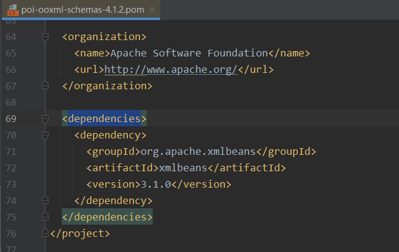

# EasyExcel 记录一个被自己蠢哭的Bug

项目中 easyExcel 相关依赖：

```xml
<!--excel解析-->
<dependency>
    <groupId>com.alibaba</groupId>
    <artifactId>easyexcel</artifactId>
    <version>3.1.0</version>
</dependency>
<!--excel解析依赖-->
<dependency>
    <groupId>org.apache.xmlbeans</groupId>
    <artifactId>xmlbeans</artifactId>
    <version>5.0.3</version>
</dependency>
```

这里再进行项目搭建时，选择的都是最新版本的依赖。

导出业务代码如下：

```java
@ApiOperation("Excel数据的导出")
@GetMapping("/export")
public void download(HttpServletResponse response) throws IOException {
    // 这里注意 有同学反应使用swagger 会导致各种问题，请直接用浏览器或者用postman
    response.setContentType("application/vnd.ms-excel");
    response.setCharacterEncoding("utf-8");
    // 这里URLEncoder.encode可以防止中文乱码 当然和easyexcel没有关系
    String fileName = URLEncoder.encode("mydict", "UTF-8").replaceAll("\\+", "%20");
    response.setHeader("Content-disposition", "attachment;filename*=utf-8''" + fileName + ".xlsx");
    EasyExcel.write(response.getOutputStream(), ExcelDictDTO.class).sheet("数据字典").doWrite(dictService.listDictData());
}
```

调用接口时报错，大致错误信息如下：

```
2022-05-31 10:19:00 [ERROR] com.matuto.common.exception.UnifiedExceptionHandler java.lang.NoSuchMethodError: org.apache.xmlbeans.XmlOptions.put(Ljava/lang/Object;)V
com.alibaba.excel.exception.ExcelGenerateException: java.lang.NoSuchMethodError: org.apache.xmlbeans.XmlOptions.put(Ljava/lang/Object;)V
    at com.alibaba.excel.write.ExcelBuilderImpl.<init>(ExcelBuilderImpl.java:42)
    at com.alibaba.excel.ExcelWriter.<init>(ExcelWriter.java:36)
    at com.alibaba.excel.write.builder.ExcelWriterBuilder.build(ExcelWriterBuilder.java:114)
    at com.alibaba.excel.write.builder.ExcelWriterBuilder.sheet(ExcelWriterBuilder.java:130)
    at com.alibaba.excel.write.builder.ExcelWriterBuilder.sheet(ExcelWriterBuilder.java:126)
    at com.matuto.srb.core.controller.admin.AdminDictController.download(AdminDictController.java:62)
    at sun.reflect.NativeMethodAccessorImpl.invoke0(Native Method)
    at sun.reflect.NativeMethodAccessorImpl.invoke(NativeMethodAccessorImpl.java:62)
    at sun.reflect.DelegatingMethodAccessorImpl.invoke(DelegatingMethodAccessorImpl.java:43)
    at java.lang.reflect.Method.invoke(Method.java:483)
    at org.springframework.web.method.support.InvocableHandlerMethod.doInvoke(InvocableHandlerMethod.java:205)
    at org.springframework.web.method.support.InvocableHandlerMethod.invokeForRequest(InvocableHandlerMethod.java:150)
    at org.springframework.web.servlet.mvc.method.annotation.ServletInvocableHandlerMethod.invokeAndHandle(ServletInvocableHandlerMethod.java:117)
    at org.springframework.web.servlet.mvc.method.annotation.RequestMappingHandlerAdapter.invokeHandlerMethod(RequestMappingHandlerAdapter.java:895)
    at org.springframework.web.servlet.mvc.method.annotation.RequestMappingHandlerAdapter.handleInternal(RequestMappingHandlerAdapter.java:808)
    at org.springframework.web.servlet.mvc.method.AbstractHandlerMethodAdapter.handle(AbstractHandlerMethodAdapter.java:87)
    at org.springframework.web.servlet.DispatcherServlet.doDispatch(DispatcherServlet.java:1067)
    at org.springframework.web.servlet.DispatcherServlet.doService(DispatcherServlet.java:963)
    at org.springframework.web.servlet.FrameworkServlet.processRequest(FrameworkServlet.java:1006)
    at org.springframework.web.servlet.FrameworkServlet.doGet(FrameworkServlet.java:898)
    at javax.servlet.http.HttpServlet.service(HttpServlet.java:655)
    at org.springframework.web.servlet.FrameworkServlet.service(FrameworkServlet.java:883)
    at javax.servlet.http.HttpServlet.service(HttpServlet.java:764)
    at org.apache.catalina.core.ApplicationFilterChain.internalDoFilter(ApplicationFilterChain.java:227)
    at org.apache.catalina.core.ApplicationFilterChain.doFilter(ApplicationFilterChain.java:162)
    at org.apache.tomcat.websocket.server.WsFilter.doFilter(WsFilter.java:53)
    at org.apache.catalina.core.ApplicationFilterChain.internalDoFilter(ApplicationFilterChain.java:189)
    at org.apache.catalina.core.ApplicationFilterChain.doFilter(ApplicationFilterChain.java:162)
    at org.springframework.web.filter.RequestContextFilter.doFilterInternal(RequestContextFilter.java:100)
    at org.springframework.web.filter.OncePerRequestFilter.doFilter(OncePerRequestFilter.java:117)
    at org.apache.catalina.core.ApplicationFilterChain.internalDoFilter(ApplicationFilterChain.java:189)
    at org.apache.catalina.core.ApplicationFilterChain.doFilter(ApplicationFilterChain.java:162)
    at org.springframework.web.filter.FormContentFilter.doFilterInternal(FormContentFilter.java:93)
    at org.springframework.web.filter.OncePerRequestFilter.doFilter(OncePerRequestFilter.java:117)
    at org.apache.catalina.core.ApplicationFilterChain.internalDoFilter(ApplicationFilterChain.java:189)
    at org.apache.catalina.core.ApplicationFilterChain.doFilter(ApplicationFilterChain.java:162)
    at org.springframework.web.filter.CharacterEncodingFilter.doFilterInternal(CharacterEncodingFilter.java:201)
    at org.springframework.web.filter.OncePerRequestFilter.doFilter(OncePerRequestFilter.java:117)
    at org.apache.catalina.core.ApplicationFilterChain.internalDoFilter(ApplicationFilterChain.java:189)
    at org.apache.catalina.core.ApplicationFilterChain.doFilter(ApplicationFilterChain.java:162)
    at org.apache.catalina.core.StandardWrapperValve.invoke(StandardWrapperValve.java:197)
    at org.apache.catalina.core.StandardContextValve.invoke(StandardContextValve.java:97)
    at org.apache.catalina.authenticator.AuthenticatorBase.invoke(AuthenticatorBase.java:541)
    at org.apache.catalina.core.StandardHostValve.invoke(StandardHostValve.java:135)
    at org.apache.catalina.valves.ErrorReportValve.invoke(ErrorReportValve.java:92)
    at org.apache.catalina.core.StandardEngineValve.invoke(StandardEngineValve.java:78)
    at org.apache.catalina.connector.CoyoteAdapter.service(CoyoteAdapter.java:360)
    at org.apache.coyote.http11.Http11Processor.service(Http11Processor.java:399)
    at org.apache.coyote.AbstractProcessorLight.process(AbstractProcessorLight.java:65)
    at org.apache.coyote.AbstractProtocol$ConnectionHandler.process(AbstractProtocol.java:890)
    at org.apache.tomcat.util.net.NioEndpoint$SocketProcessor.doRun(NioEndpoint.java:1743)
    at org.apache.tomcat.util.net.SocketProcessorBase.run(SocketProcessorBase.java:49)
    at org.apache.tomcat.util.threads.ThreadPoolExecutor.runWorker(ThreadPoolExecutor.java:1191)
    at org.apache.tomcat.util.threads.ThreadPoolExecutor$Worker.run(ThreadPoolExecutor.java:659)
    at org.apache.tomcat.util.threads.TaskThread$WrappingRunnable.run(TaskThread.java:61)
    at java.lang.Thread.run(Thread.java:745)
```

关键错误信息：java.lang.NoSuchMethodError: org.apache.xmlbeans.XmlOptions.put

找不到 put 方法，于是去这个类里面去看了下，果然没有。

于是我开始尝试更换 org.apache.xmlbeans 的依赖版本。

在我尝试了 N 个版本之后，在 3.1.0 里边找到了 put 方法。


```xml
<dependency>
    <groupId>org.apache.xmlbeans</groupId>
    <artifactId>xmlbeans</artifactId>
    <version>3.1.0</version>
</dependency>
```

然后我看了一下 easyExcel 的pom文件，最后发现里边竟然有 xmlbeans 的引用。

easyexcel -> easyexcel-parent -> poi-ooxml-schemas -> xmlbeans



## 我想哭 😭

排了半天的bug, 虽然问题解决了。但是，我没想到这个依赖不用自己添加。被自己蠢哭了，（一种绿色植物）。