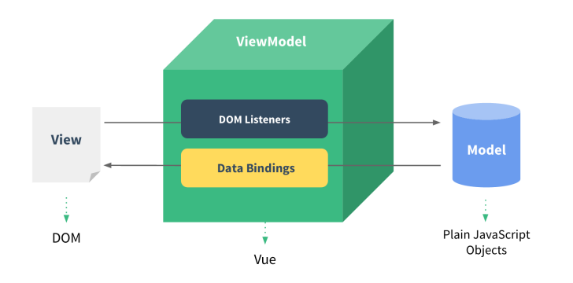

# 02 ES6 + Axios 知识点

> var 和 let 的区别

```js
//声明变量
let a
let b,c,d
let e = 100
let f = 521, g = 'iloveyou', h = []

//1. let 变量不能重复声明
let name = 'Helen'
// let name = '环'//报错：SyntaxError: Identifier 'name' has already been declared

//2. let 存在块儿级作用域，let 和 var 都具备函数级别的作用域
// if else while for 
{
   let star = 5
}
console.log(star)//报错：star is not defined

//3. let 不存在变量提升
console.log(song)//报错：Cannot access 'song' before initialization
let song = '依然爱你';
```

> 解构赋值 - ES6 允许按照一定模式从数组和对象中提取值，对变量进行赋值，

```js
//1. 数组的解构
const F4 = ['小沈阳','刘能','赵四','宋小宝']
let [xiao, liu, zhao, song] = F4
console.log(xiao)
console.log(liu)
console.log(zhao)
console.log(song)

//2. 对象的解构
const zbs = {
    username: '赵本山',
    age: '不详',
    xiaopin: function(){
        console.log("演小品");
    }
}

let {username, age, xiaopin} = zbs
console.log(username)
console.log(age)
console.log(xiaopin)
xiaopin()

//3. 根据名字自动解构
// let {xiaopin} = zbs
// xiaopin()
```

> js 中没有函数重载

在 js 中是没有函数重载这个概念的，后定义的函数会把先定义的函数给覆盖掉。

```js
function add(a) {
    return 100 + a
}

function add() {
    return 100
}

let reulst = add(10) // 这里会调用第二个方法
console.log(reulst) // 结果是 100
```

> ES6的异步编程 - Promise

```js
// 异步编程解决方案：文件的读取、ajax等等
const fs = require('fs') // 引入 node.js 中的本地文件扩展模块

// 实例化Promise
// Promise 对象有三个状态：初始化状态、成功、失败
// resolve：函数类型的参数，可以将promise的状态设置为成功
// reject：函数类型的参数，可以将promise的状态设置为失败
const p = new Promise((resolve, reject) => {
    // 执行异步操作
    // 第一个参数：读取的文件的路径
    // 第二个参数：读取过程中对响应结果的处理
    fs.readFile('./ta.txt', (err, data) => {
        // 当文件读取失败时的错误对象
        if (err) {
            reject(err) // 将promise的状态设置为失败
        }
        // 当文件读取成功时的文件内容
        resolve(data) // 将promise的状态设置为成功
    })
})
// p.then()  当promise的状态为成功时，then被调用
// p.catch() 当promise的状态为失败时，catch被调用
p.then((response) => { // 成功业务逻辑
    console.log(response.toString())
}).catch(err => { // 失败业务逻辑
    console.log('出错了')
    console.log(error)
})
```

> vscode 补充 html 基本框架快捷键

! + Tab键

>Axios 是一个基于 promise 的 HTTP 库

官方网站：http://www.axios-js.com

```html
<!DOCTYPE html>
<html lang="en">
  <head>
    <meta charset="UTF-8" />
    <meta name="viewport" content="width=device-width, initial-scale=1.0" />
    <title>Document</title>
  </head>
  <body>
    <script src="axios.js"></script>
    <script>
      //基于promise
      axios({
        method: 'get',
        url: 'http://localhost:8080/user/list',
      })
        .then((response) => {
          console.log('获取数据成功', response)
        })
        .catch((error) => {
          console.log('获取数据失败', error)
        })

      //另一种写法
      axios
        .get('http://localhost:8080/user/list')
        .then((response) => {
          console.log('获取数据成功1', response)
        })
        .catch((error) => {
          console.log('获取数据失败1', error)
        })
    </script>
  </body>
</html>
```

> axios 自定义配置

```js
//使用自定义配置
const request = axios.create({
    baseURL: 'http://localhost:8080', //url前缀
    timeout: 1000, //超时时间
    headers: {'token': 'helen123456'} //携带令牌
})

//基于promise
//注意：这里使用了前面定义的request
request({
    method:'get',
    url:'/user/list'
}).then(response => {
    console.log('获取数据成功', response)
}).catch(error => {
    console.log('获取数据失败', error)
})
```

> axios 拦截器

```js
// 请求拦截器
request.interceptors.request.use(
  function (config) {
    // 在发送请求之前做些什么，例如：在请求头中携带一个令牌
    config.headers.token = 'helen123456'
    return config
  },
  function (error) {
    // 对请求错误做些什么
    return Promise.reject(error)
  }
)

// 添加响应拦截器
request.interceptors.response.use(
  function (response) {
    // 对响应数据做点什么，例如：使用response.data替代response，简化前端拿到的数据结果
    return response.data
  },
  function (error) {
    // 对响应错误做点什么
    return Promise.reject(error)
  }
)
```

> 模块化

```html
// 导出
export let star = '王力宏';

export function sing(){
  console.log('大城小爱')
}

let star = '王力宏';

function sing(){
  console.log('大城小爱')
}

export {star, sing}

<!DOCTYPE html>
<html lang="en">
<head>
  <meta charset="UTF-8">
  <meta name="viewport" content="width=device-width, initial-scale=1.0">
  <title>Document</title>
</head>
<body>
  <script type="module">
    import * as m1 from './m1.js'
    import * as m2 from './m2.js'

    console.log(m1)
    console.log(m2)

    console.log(m1.star)
    console.log(m2.star)
    
    //还可以这样导入：解构赋值的形式
    import {star, sing} from './m1.js'
    import {star as star2} from './m2.js' //使用as防止重名
    console.log(star)
    sing()
    console.log(star2)
    
  </script>
</body>
</html>
```


> default 导入导出

```js
//可以导出任意类型，但同时只能有一个export default
// export default 'helen'
// export default 99

//大部分情况是导出对象
export default{
    username: 'helen',
    age: 20,
    coding(){
      console.log('hello world')
    } 
 }

// 引用
import m3 from './m3.js'
console.log(m3)
```

> 项目封装

1、创建app.js 将其他模块引入到 app.js 中

```js
import * as m1 from './m1.js'
import * as m2 from './m2.js'
import m3 from './m3.js'

console.log(m1)
console.log(m2)
console.log(m3)
```

2、在项目入口处引入 app 模块

```html
<!DOCTYPE html>
<html lang="en">
<head>
  <meta charset="UTF-8">
  <meta name="viewport" content="width=device-width, initial-scale=1.0">
  <title>Document</title>
</head>
<body>
  
  <script src="app.js" type="module"></script>
</body>
</html>
```

> 双向数据绑定

- 当数据发生变化的时候，视图也会跟着发生变化

- - 数据模型发生了改变，会直接显示在页面上

- 当视图发生变化的时候，数据也会跟着同步变化

- - 用户在页面上的修改，会自动同步到数据模型中去

**注意：**v-model只用于用户交互组件中

> MVVM



> 反转字符串

```js
'hello'.split('').reverse().join('')
// split 拆分为数组
// reverse 将数组数据反转
// join 将数组数据组装
```