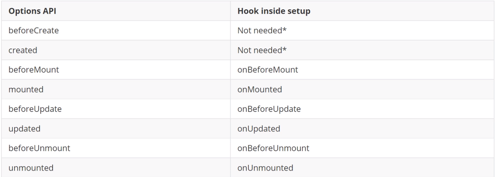

# vue3 入门学习

## 基础

> 安装 cli

`npm install -g @vue/cli`

> 创建项目

`vue create vue-demo`

注意：vue-demo - 项目名称，不能有大写字符，多单词之间用 - 来连接

> 启动项目

`npm run server`

### 项目架构解析

- src 编写源码的地方
  
  - assets - 静态资源文件夹
  
  - components - 组件文件夹
  
  - App.vue - 程序主入口组件,根组件
  
  - main.js - 主入口文件
  
  - registerServiceWorker.js - 程序监听组件

### 模板语法

> 文本渲染

```html
<p>{{message}}</p>

data(){
    return {
      message: "测试"
    }
  }
```

> 原始HTML渲染

双大括号会以文本的方式渲染

渲染html需要使用 v-html属性

```html
<div v-html="rawHtml"></div>
data(){
 return {
     rawHtml: "<a href='http://www.baidu.com'>百度</a>"
 }
}
```

> 属性

```html
<div b-bind:id="dynamicId"></div>
简写：<div :id="dynamicId"></div>

data(){
    return {
      dynamicId: 1001
    }
  }
```

> 支持JL表达式

```js
{{ ok ? "yes" : "no"}}
{{ num + 10 }}
```

### 条件渲染

> v-if

```js
<p v-if="flag">我是孙悟空</p>
data(){
    return {
      flag: true
    }
  }
```

> v-else

```html
<p v-if="flag">我是孙悟空</p>
<p v-else>我是猪八戒</p>
```

> v-show

```html
<p v-show="flag">你真的是孙猴子吗</p>
```

#### v-if 与 v-show的区别

1. v-if 是真正的条件渲染，因为他会确保在切换过程中，条件快内的事件监听器和子组件适当的被销毁和重建

2. v-if 也是惰性的：如果在初始渲染条件为假，则什么也不做---直到条件第一次变为真时，才会开始渲染条件块。

3. 一般来说，v-if 有更高的切换开销，而 v-show 有更高的初始渲染开销。因此，如果需要非常频繁的切换，则使用 v-show 更好，如果在运行时条件很少改变，则用 v-if 更好

### 列表循环

> v-for

```html
<ul>
      <li v-for="item in newsList">
        {{item.title}}
      </li>
    </ul>
```

#### 维护状态

当 Vue 正在更新使用 or 染的元素列表时，它默认使用“就地更新”的策略。如果数据项的顺序被改变Vue 将不会移动 DOM 元素来匹配数据项的顺序，而是就地更新每个元素，并且确保它们在每个索引位置正确渲染。

解释：当一个列表中有三条数据，新增或修改一条时，原有未修改数据不会重新渲染，只会渲染被操作的数据，节省性能

为了给 Vue 一个提示从而重用和重新排序现有元素以便它能跟踪每个节点的身份你需要为每项提供一个唯一的 key attribute

```html
<ul>
      <li v-for="item in newsList" :key="item.id">
        {{item.title}}
      </li>
    </ul>

<ul>
      <li v-for="(item, index) in newsList" :key="index">
        {{item.title}}
      </li>
    </ul>
```

### 事件

> 监听事件

我们可以使用  on 指令(通常缩写为 @ 符号)来监听 DOM 事件，并在触发事件时执行一些avaScript。用法为 v-on:click="methodName”或使用快捷方式 @cick="methodName"

```html
<button v-on:click="counter += 1">点击: counter = {{counter}}</button>
<button @click="counter += 1">点击: counter = {{counter}}</button>
```

> 事件处理方法

```js
<button @click="counter += 1">点击: counter = {{counter}}</button>

<button @click="clickHandle">撤回</button>
<p>{{message}}</p>
methods: {
    clickHandle() {
      // 在事件中，读取data中的属性，是需要通过this.属性
      this.message = "消息被撤回了"
    },
    clickHandle(event) {
      // event 是原生的 DOM event
      if (event) {
        alert(event.target.tagName)
      }
    }
  },

   this.message = "消息被撤回了"
    },
    clickHandle(event) {
      // event 是原生的 DOM event
      if (event) {
        alert(event.target.tagName)
      }
    }
  },
```

> 内联处理器中的方法-参数方法

```html
<button @click="say('hi')">say hi</button>
<button @click="say('what')">say what</button>
say(data) {
      console.log(data);
    }
```

### 表单

> 双向绑定 - v-model

```html
<input type="text" v-model="username" >
```

> 修饰符

- .lazy    在默认情况下v-model 在每次 nput 事件触发后将输入框的值与数据进行同步。你可以添加 azy 修饰符，从
  而转为在*change 事件之后进行同步

- .trim    如果要自动过滤用户输入的首尾空白字符，可以给 vmodel 添加 trim修饰符

## 组件

### 单文件组件

Vue 单文件组件 (后缀名名 vue 文件，缩写为 SFC) 是一种特殊的文件格式，它允许将 Vue 组件的模板、逻辑与 样式封装在单个文件中

#### 示例

```html
<template>
    <h3>我是单文件组件</h3>
</template>

<script>
    export default {
        name:"MyComponent"
    }
</script>

<style>
h3{
    color: red;
}
</style>
```

#### 使用

1. 引入组件    

```html
import MyComponent from "./components/MyComponent.vue"
```

2. 挂载组件

```js
components: {
    MyComponent
  }
```

3. 显示组件

```html
<MyComponent/><my-component/>
```

> style 标签的 scoped 属性

scoped:如果在style中添加了此属性，就代表着，当前样式，只在当前组件中生效

### 组件的组织

通常一个应用会以一棵嵌套树的形式来组织

### Props 组件交互

组件之间需要存在交互  Props 使你可以在组件上注册一些属性

#### 使用

> 传递参数

```html
<MyComponentVue :title="title"/>

<template>
  
  <MyComponentVue :title="title"/>
</template>

<script>

import MyComponentVue from './components/MyComponent.vue'

export default {
  name: 'App',
  data() {
    return {
      title: "我是一个标题"
    }
  },
  components: {
    MyComponentVue
  }
}
</script>
```

直接在引用的组件上使用参数名
将一个字符串属性值，变为动态数据，在前加冒号 :

> 接收参数

```html
props: {
    title:{
        type: String,
        default: ""
    }
}


<template>
    <h3>prop 参数传递</h3>
    <p>{{ title }}</p>
</template>

<script>
    export default{
        name: "MyComponent",
        props: {
            title:{
                type: String,
                default: ""
            }
        }
    }
</script>
```

> 数组和对象必须使用函数进行返回

```html
names: {
    type:Array,
    // 数组和对象必须使用函数进行返回
    default:function(){
         return []
    }
}
<MyComponentVue :names="names"/>
```

### 自定义事件发送数据

自定义事件可以在组件中反向传递，prop 可以将数据从父组件传递到子组件，那么反向如何操作呢，就可以利用自定义事件实现 Semit

> 传递参数

```html
<template>
  
  <MyComponent @onCustom="getDataHandle"/>
  {{ message }}
</template>

<script>

import MyComponent from "./components/MyComponent.vue"

export default {
  name: 'App',
  data() {
    return {
      message: ""
    }
  },
  components: {
    MyComponent
  },
  methods: {
    getDataHandle(data) {
      this.message = data
    }
  },
}
</script>
```

> 接收参数

```html
<template>
    <h3>自定义事件发送数据</h3>
    <button @click="sendHandle">发送数据</button>
</template>

<script>
    export default{
        name: "MyComponent",
        data() {
            return {
                message: "子组件传递的数据"
            }
        },
        methods: {
            sendHandle(){
                this.$emit("onCustom", this.message)
            }
        },
    }
</script>
```

### 组件生命周期

- 创建时
  - beforeCreate - 组件准备创建
  - created - 组件创建完成
- 渲染时
  - beforeMount - 渲染前
  - mounted - 渲染后
- 更新时
  - beforeUpdate - 数据更新前
  - updated - 数据更新后
- 卸载时
  - beforeUnmount - 组件卸载前
  - unmounted - 组件卸载后

## 引入第三方

### Swiper

> 特点

- swiper 开源、免费、强大的触摸滑动插件

- swiper 是纯javascript打造的滑动特效插件，面向手机、平板电脑等移动终端

- swiper 能实现触屏焦点图、触屏Tab切换、触屏轮播图切换等常用效果

> 安装

- cnpm install --save swiper

> 使用

- 基础
  
  ```js
  import { Swiper, SwiperSlide } from 'swiper/vue'
  import 'swiper/css';
  
  components: {
      Swiper,
      SwiperSlide
    }
  
  <swiper>
        <swiper-slide>
          
        </swiper-slide>
        <swiper-slide>
          
        </swiper-slide>
        <swiper-slide>
          
        </swiper-slide>
      </swiper>
  ```

- 添加指示器
  
  ```js
  import { Pagination } from 'swiper/modules';
  import 'swiper/css/pagination'
  
  <swiper :modules="modules" :pagination="{ clickable:true }"></swiper>
  
  data() {
      return {
        modules: [ Pagination ]
      }
    },
  ```

### Axios

#### 安装

    npm install --save axios

#### 使用

> 引入

```js
import axios from "axios"
```

> get请求

```js
 mounted() {
  // get请求
  axios({
    method:"get",
    url: "http://iwenwiki.com/api/blueberrypai/getChengpinDetails.php"
  }).then(res => {
    console.log(res.data)
    this.chengpin = res.data.chengpinDetails[0]
  })
},

// 简写方式

axios.get("http://iwenwiki.com/api/blueberrypai/getChengpinDetails.php").then(res => {
    console.log(res.data)
  })
```

> post示例

- post请求参数需要额外处理
  - 安装依赖：npm install --save querystring
  - 转换参数格式：qs.stringify({})

```js
axios({
    method:"post",
    url:"http://iwenwiki.com/api/blueberrypai/login.php",
    data: querystring.stringify ({
      user_id: "iwen@qq.com",
      password: "iwen123",
      verification_code: "crfvw"
    })
  }).then(res => {
    console.log(res.data)
  })

  // 简写方式

  axios.post("http://iwenwiki.com/api/blueberrypai/login.php", querystring.stringify({
    user_id: "iwen@qq.com",
    password: "iwen123",
    verification_code: "crfvw"
  })).then(res => {
    console.log(res.data)
  })
```

#### 全局引入

> 挂载全局

```js
import axios from 'axios'

// 将Axios挂载到全局
const app = createApp(App)
app.config.globalProperties.$axios = axios
app.mount('#app')
```

> 使用

```js
this.$axios.get("http://iwenwiki.com/api/blueberrypai/getChengpinDetails.php")
    .then(res => {
      console.log(res.data)
    })
```

#### 网络请求的封装

1.创建request.js工具类

```js
import axios from 'axios'
import qs from 'querystring'

const errorHandle = (status, info) => {
    switch(status) {
        case 400:
            console.log("语义有误");
            break;
        case 401:
            console.log("服务器认证失败");
            break;
        case 403:
            console.log("服务器拒绝访问");
            break;
        case 404:
            console.log("地址错误");
            break;
        case 500:
            console.log("服务器遇到意外");
            break;
        case 502:
            console.log("服务器无响应");
            break;
        default:
            console.log(info);
            break;
    }
}

const instance = axios.create({
    // 网络请求的公共配置
    timeout: 5000
})

// 拦截器最常用

// 发送数据之前
instance.interceptors.request.use(
    // 成功
    config => {
        if(config.method == "post") {
            config.data = qs.stringify(config.data)
        }
        // config: 包含着网络请求的所有信息
        return config;
    },
    // 失败
    error => {
        return Promise.reject(error)
    }
)

// 获取数据之前
instance.interceptors.response.use(
    // 请求成功，已成功的方式返回，失败调用失败的方法
    response => {
        return response.status === 200 ? Promise.resolve(response) : Promise.reject(response)
    },
    // 失败
    error => {
        const { response } = error;
        // 错误的处理才是需要关注的
        errorHandle(response.status, response.info)
    }
)

export default instance;
```

2.创建基础服务

新建api文件夹，创建index.js

```js
const base = {
    baseUrl: "http://iwenwiki.com/api",
    testGet: "/blueberrypai/getChengpinDetails.php"
}

export default base
```

3.创建api组件

```js
import axios from "../utils/request"
import path from "./path"

const api = {
    testGet() {
        return axios.get(path.baseUrl + path.testGet)
    }
}

export default api
```

4.使用

```js
mounted() {
    api.testGet().then(res => {
      console.log(res)
      this.message = res
    })
  },
```

#### 跨域问题

JS采取的是同源策略
同源策略是浏览器的一项安全策略，浏览器只允许is 代码请求和当前所在服务器域名,端口,协议相同的数据接口上的数据，这就是同源策略
也就是说，当协议、域名、端口任意一个不相同时，都会产生跨域问题

> 解决方式

- 后台：cors

- 前台：proxy
  
  ```js
  const { defineConfig } = require('@vue/cli-service')
  module.exports = defineConfig({
    transpileDependencies: true,
    devServer: {
      proxy:{
        '/api':{
          target: '<url>',
          changeOrigin: true
        }
      }
    }
  })
  ```

### vue-router

#### 安装

`npm install --save vue-router`

#### 使用

1.创建页面

```html
<template>
    <h3>Hemo页面</h3>
</template>
```

2.新建router目录 创建index.js文件

```js
import { createRouter, createWebHistory} from 'vue-router'
import HomeView from "../views/HomeView";

const routes  = [
    {
        path:"/",
        name: "home",
        component:HomeView
    },
    {
        path:"/about",
        name: "about",
        component:() => import(/* webpackChunkName: "about" */ '../views/AboutView.vue')
    }
];

const router = createRouter({
    history: createWebHistory(process.env.BASE_URL),
    routes
});

export default router;
```

3.使用路由

在 main.js 中使用

```js
import router from "./router";
createApp(App).use(router).mount('#app')
```

4.在 App 中加载路由页面

```html
<template>
  <router-view></router-view>
</template>
```

5.路由跳转

```html
<nav>
    <router-link to="/">Home</router-link> |
    <router-link to="/about">About</router-link>
 </nav>
```

#### 路由参数传递

1.在路由配置中指定参数的key

```js
{
    path: '/news/details/:name',
    name: 'news-details', 
    component: () => import('../views/NewsDetailsView.vue')
  }
```

2.在跳转过程中携带参数

```html
<ul>
        <li><router-link to="/news/details/百度">百度新闻</router-link></li>
        <li><router-link to="/news/details/网易">网易新闻</router-link></li>
        <li><router-link to="/news/details/头条">头条新闻</router-link></li>
    </ul>
```

3.详情页读取路由携带的参数

```html
<p>{{ $route.params.name }}</p>
```

#### 嵌套路由

1. 创建页面

创建about文件夹 及 us和info页面

2. 配置
   
   ```js
   children:[
        {
          // 二级导航的路径不加 /
          path: "us",
          component: ()=> import("../views/about/AboutUs.vue")
        },{
          path: "info",
          component: ()=> import("../views/about/AboutInfo.vue")
        }
      ]
   ```

3. 显示及跳转
   
   ```js
   <template>
   <div class="about">
    <router-link to="/about/us">关于我们</router-link>|
    <router-link to="/about/info">关于信息</router-link>
    <router-view ></router-view>
   </div>
   </template>
   ```

4. 重定向
   `redirect: "/about/us",`

### Vuex

#### 安装

   `npm install --save vuex`

#### 使用

1. 创建store目录 index.js文件
   
   ```js
   import { createStore } from "vuex";
   // Vuex的核心作用就是帮我们管理组件之间的状态
   export default createStore({
     // 所有的状态都放在这里(数据)
     state:{
         counter: 0
     }
   })
   ```

2. 在main.js中使用 vuex

`createApp(App).use(vuex).mount('#app')`

3. 在组件中使用vuex 获取值

```html
   <p>counter = {{ $store.state.counter }}</p>
   // 快捷读取
   <template>
   <div class="hello">
    <h1>{{ msg }}</h1>
    <p>counter = {{ $store.state.counter }}</p>
    <p>{{ counter }}</p>
   </div>
   </template>

    <script>
    import { mapState } from "vuex"
    export default {
      name: 'HelloWorld',
      props: {
        msg: String
      },
      // 专门来读取vuex的数据
      computed: {
        ...mapState(["counter"])
      }
    }
    </script>

    <!-- Add "scoped" attribute to limit CSS to this component only -->

    <style scoped>
    h3 {
      margin: 40px 0 0;
    }
    ul {
      list-style-type: none;
      padding: 0;
    }
    li {
      display: inline-block;
      margin: 0 10px;
    }
    a {
      color: #42b983;
    }
    </style>
```

#### 状态管理核心

> getters

数据过滤处理

```js
getters: {
       getCounter(state){
           return state.counter > 0 ? state.counter : "counter数据异常"
       }
     }

      <p>counter = {{ $store.getters.getCounter }}</p>

      // 快捷使用
      import { mapGetters } from "vuex"

      computed: {

          ...mapGetters(["getCounter"])
        }

   <p>{{ getCounter }}</p>
```

> Mutation

更改 Vuex的store 中的状态的唯一方法是提交 mutation。Vuex 中的 mutation 非常类似于事件: 每个mutation 都有一个字符串的事件类型type)和一个回调函数(handler)。这个回调函数就是我们实际进行状态更改的地方，并且它会接受 state 作为第一个参数

 优势：在任何页面做了修改之后，其他页面同步响应

```js
mutations: {
    addCounter(state) {
        state.counter++
    }
}

<button @click="addClickHandle">增加</button>

methods: {
    // 固定调用方式
    addClickHandle() {
        this.$store.commit("addCounter")
    }
},

// 快捷使用
methods: {
    ...mapMutations(["addCounter"]),
    // 固定调用方式
    addClickHandle() {
       // this.$store.commit("addCounter", 10)
       this.addCounter(20)
    }
},    

// 传递参数
mutations: {
    addCounter(state, number) {
        state.counter += number
    }
}

// 固定调用方式
addClickHandle() {
    this.$store.commit("addCounter", 10)
}
```

> Actions

与 Mutation 一样 修改数据，但是为异步操作

```js
// 为异步操作所准备的
actions: {
    asyncAddCounter({ commit }) {
        axios.get("http://iwenwiki.com/api/generator/list.php").then(res => {
            commit("addCounter", res.data[0])
        })
    }
}


this.$store.dispatch("asyncAddCounter")


 ...mapActions(["asyncAddCounter"]),
this.asyncAddCounter()
```


## vue3 新特性

### 六大亮点

- Performance：性能比 Vue 2 更强
- Tree shaking support: 可以将无用模块“剪辑”，仅打包需要的
- Composition API: 组合API
- Fragment, Teleport, Suspense:“碎片”，Teleport即Protal传送门，“悬念”
- Better TypeScript support: 更优秀的Ts支持
- Custom Renderer API: 暴露了自定义染API


### 组合式API

#### ref 或者 reactive

将在data中定义的数据 转到setup中

```js
const name = ref("matuto")

const names = reactive({      data: ["张三","李四", "王五"]    })

```


#### 声明方法

```js
// 声明方法

function clickHandle() {
    message.value = "majz"
}
```


#### 使用props和context

在2.x中，组件的方法中可以通过this获取到当前组件的实例，并执行data变量的修改，方法的调用，组件的通信等等，但是在3.x中，setup0在beforeCreate和created时机就已调用，无法使用和2.x一样的this但是可以通过接收setup(props,ctx)的方法，获取到当前组件的实例和props

> setup() 中没有this - 使用 context

```js
export default {
  name: 'HelloWorld',
  props: {
    msg: String
  },
  // 组合式api
  setup(props) {


    const msg = props.msg
    const message = ref("matuto")


    const names = reactive({
      data: ["张三","李四", "王五"]
    })


    function clickHandle() {
      message.value = "majz"
    }


    return {
      message,
      names,
      clickHandle,
      msg
    }
  }
}

```

#### 使用生命周期函数



```js
// 比以前有优势，以前同一个生命周期函数只能存在一个，现在可以存在多个
    onMounted(() => {
      console.log("生命周期函数：onMounted")
    })
    onMounted(() => {
      console.log("生命周期函数：onMounted2")
    })
```

#### Provide / Inject

- provide()和 inject()可以实现嵌套组件之间的数据传递。

- 这两个函数只能在 setup() 函数中使用。

- 父级组件中使用 provide()函数向下传递数据。

- 子级组件中使用liect0 获取上层传递过来的数据。

- 不限层级。

```js
// 父组件

import { provide } from "vue";
setup() {
    provide("message", "我是消息信息")
  }

// 子组件

import { inject } from "vue";

const message = inject("message")
```
